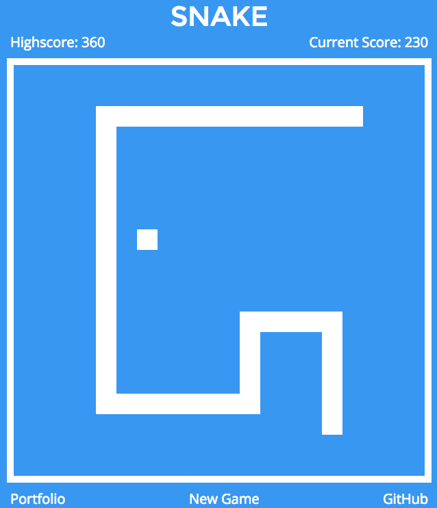

# DOMQuery

DOMQuery is a library that that allows users to modify DOM elements.

### Import DOMQuery
DOMQuery is imported by downloading `DOMQuery/lib` and requiring `const $l = require('../DOMQuery/lib/main.js');` at the top of Snake's `js/main.js` file.

[DEMO: Snake made using this DOMQuery library](http://www.daviddipanfilo.com/DOMQuery)

### $l Functions
#### `$l`
This returns a packaged node element, if given a string or object.
This returns passes callbacks to another function.

#### `$l.ajax`
This creates an asynchronous HTTP (Ajax) request.

## Methods
#### `html`
This sets the innerHTML of each node to the given string.
When no argument is provided, this returns the innerHTML of the first node.

#### `empty`
This clears the innerHTML of the node it is called on.

#### `append`
This inserts content to the end of each matched element.

#### `attr`
This gets the value of an attribute for the first element in the set of elements.
When a second argument is provided, each element's attribute is set to the specified value.

#### `addClass`
This adds the specified class(es) to each element in the matched set of elements.

#### `removeClass`
This removes the specified class(es) from each element in the matched set of elements.

#### `toggleClass`
If present, this removes the specified class.  If absent, this method adds the specified class.

#### `children`
This retrieves the children of an element.

#### `parent`
This retrieves the children of an element.

#### `find`
This gets the descendants of each element in the current set of elements, filtered by an input.

#### `remove`
This removes the elements it is called on from the document.

#### `on`
This attaches event handlers to the selected elements.

#### `off`
This removes event handlers from the selected elements.

#### `eq`
This constructs a new node from the element at the specified index.

#### `text`
This sets the content of the matched element to the specified string.
